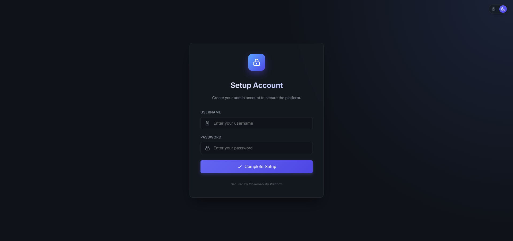
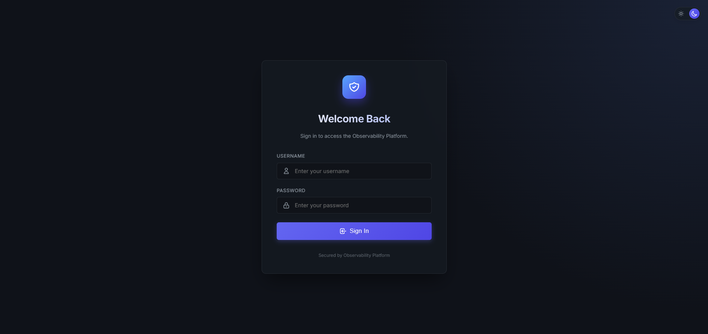
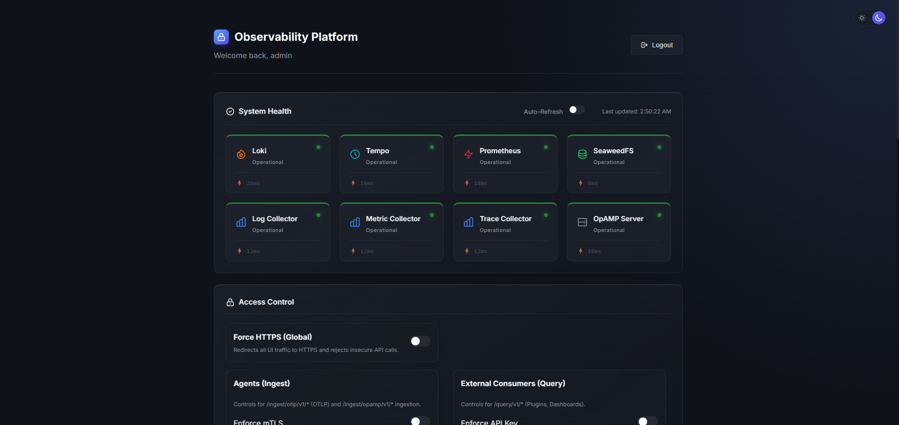
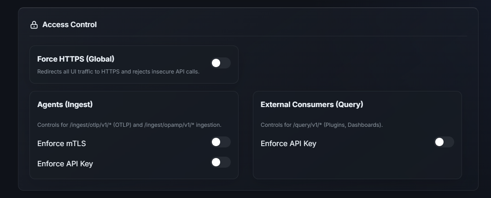
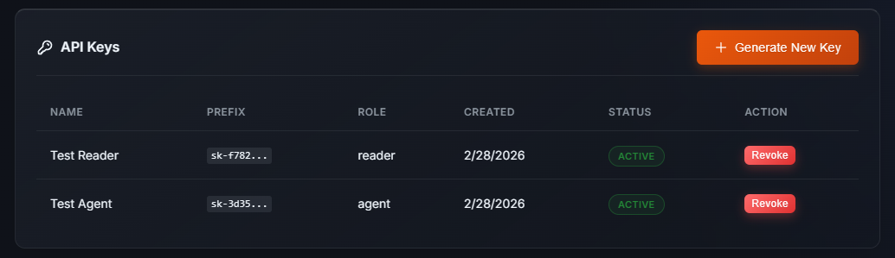
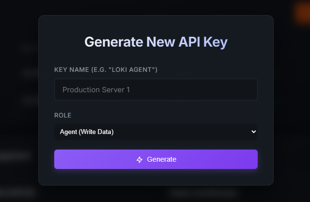
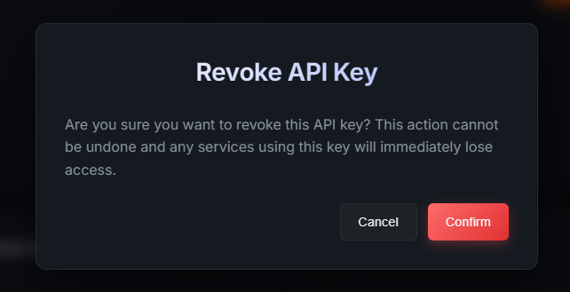
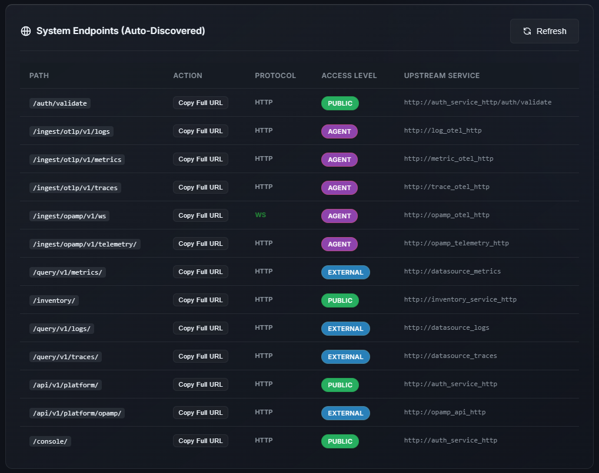

# IyziTrace Observability Platform ✨

Welcome to **IyziTrace Observability Platform** – a comprehensive, standalone OpenTelemetry-native observability platform. This repository contains a production-ready, Docker Compose-based backend observability suite designed for high performance, ease of use, and deep visibility.

It seamlessly integrates Tempo (Traces), Loki (Logs), Prometheus/Thanos (Metrics), OpenTelemetry Collectors, and a robust NGINX-based API gateway with built-in Authentication.

---

## 📖 Table of Contents

* [Introduction](#-introduction)
* [Architecture & Services](#-architecture--services)
* [Quick Start Guide](#-quick-start-guide)
* [User Guide](#-user-guide)
  * [1. Initial Setup & Login](#1-initial-setup--login)
  * [2. User Interface Overview](#2-user-interface-overview)
  * [3. Security & API Keys](#3-security--api-keys)
  * [4. System Endpoints (Auto-Discovered)](#4-system-endpoints-auto-discovered)
* [Data Ingestion Guide](#-data-ingestion-guide)
  * [Authentication Mechanisms](#authentication-mechanisms)
  * [Ingestion Endpoints](#ingestion-endpoints-https-port-443--http-port-80)
  * [Ingestion Examples](#ingestion-examples)
    * [🟢 Node.js](#nodejs)
    * [🐍 Python](#python)
    * [🐹 Go](#go)
    * [☕ Java](#java)
    * [🟣 C# (.NET)](#c-net)
* [Data Query Guide](#-data-query-guide)
  * [Query Endpoints](#query-endpoints-https-port-443--http-port-80)
* [Notes & Production Deployment](#-notes--production-deployment)
* [Component Documentation](#-component-documentation)
* [Community & Contribution](#-community--contribution)
* [Meta](#meta)
* [Legal & Compliance](#legal--compliance)

---

## 🌟 Introduction

IyziTrace Observability Platform provides zero-maintenance data pipelines for unifying traces, metrics, and logs. It's built heavily on the OpenTelemetry standard, meaning you can easily point any OTLP-compatible SDK to this stack.

**Core Highlights:**
- **Standalone Observability Platform**: Works entirely by itself out-of-the-box.
- **OpenTelemetry Native**: Fully compatible with OTLP over gRPC and HTTP.
- **Secure by Default**: Supports **iyzitrace-api-key** authentication out of the box.
- **Unified Datastores**: Tempo for Traces, Loki for Logs, and Prometheus/Thanos for Metrics.

Platform API reference:
- OpenAPI gateway spec: [docs/platform-api.openapi.yaml](docs/platform-api.openapi.yaml)

---

## 🏗️ Architecture & Services

This stack provisions the following core services:

- **Auth & Console Service (`:8081`)**: Powers the Console UI, API Key generation, and Custom API Key authentication.
- **Tempo (`:3200`)**: Distributed tracing backend.
- **Loki (`:3100`)**: Log aggregation system.
- **Prometheus (`:9090`) & Thanos (`:10901`/`:10902`)**: Time-series metrics datastore with long-term retention.
- **OpenTelemetry Collectors**: Dedicated pipelines for Traces, Metrics, and Logs.
- **NGINX Reverse Proxy (`:80`, `:443`)**: Handles TLS termination, API Key validation, and request routing.
- **Init-Certs Container**: Automatically generates bootstrap TLS certificates for initial installations.

---

## 🚀 Quick Start Guide

**Prerequisites:**
- Docker Engine (v20+)
- `docker compose` V2

### 1. Start the Stack

Use the Makefile — it creates the local data directories, generates secrets via `setup/generate_credentials.py`, and starts docker compose:

```bash
make up         # start without rebuilding images
make up-build   # start and rebuild images first
```

Other useful targets:

```bash
make down       # stop and remove containers + volumes
make restart    # equivalent to `make down && make up`
make logs       # tail logs from all services
```

### 2. Verify Health & Access UIs

Wait for all services to initialize. You can check the health of the system directly from the **Console UI** or via the protected API Health Endpoint:

- **IyziTrace Console**: `https://localhost` (or `http://localhost/console/`)
- **System Health Status API**: `https://localhost/api/v1/platform/system/status` (Requires JWT Authentication)
  
*Note: The Console UI features a built-in dashboard card that pulls the live status of backend services (Tempo, Loki, Prometheus, and Authentication).*

---

## 🖥️ User Guide

The IyziTrace Observability Platform comes with an integrated Console UI to manage authentication, configurations, and certificates—all from a comprehensive, single-page interface. This section walks you through how to use the dashboard natively.

### 1. Initial Setup & Login

When you boot the IyziTrace Observability Platform for the first time and visit `https://localhost`, you will be greeted by the Initial Setup screen.

![Placeholder: Initial Setup Screen Screenshot here]

**Setup Functionality:**
- Enter an Administrator Username.
- Enter a secure password (minimum 8 characters). 
- Clicking **Complete Setup** initializes your secure internal `auth.db` database. 
- You will then be redirected to the Login screen to authenticate.



**Login Functionality:**
- Use the credentials created during setup to log in.
- This creates a JWT session token that grants administrative access directly to the Console UI.



### 2. User Interface Overview

Once logged in, you will be presented with the Console. Operations are handled dynamically on this centralized screen.



**Console UI Components:**
- **System Health Overview**: A live status card monitoring backend services like Tempo, Loki, and Prometheus.
- **Theme Toggle**: A switch to quickly change the UI between light and dark modes.
- **Security & Access Control**: Toggles for enforcing global HTTPS and requiring APIs for ingress and queries.
- **API Keys**: A localized table for generating and revoking role-based api keys.
- **System Endpoints**: A dynamic table discovering all active API routes and displaying their current authentication requirements.

### 3. Security & API Keys

Locking down edge ingestion allows your IyziTrace Observability Platform to safely sit in cloud-native externalized environments. 



**Security Toggles Section:**
- **Enforce API Key (Agents)**: Check this box to enforce that open agents pushing metrics via OpenTelemetry must send a valid `iyzitrace-api-key` header.
- **Enforce API Key (External Consumers)**: Require API keys for external querying components running API requests against your IyziTrace Observability Platform.
- **Force HTTPS (Global)**: Refuse raw HTTP edge ingress on the Nginx proxy; redirect standard browsers and strictly drop insecure backend OTEL collector traffic.

**API Key Management:**
- Located within the same unified layout, you can view the list of generated API keys including their prefix (`sk-XXXX...`), creation date, and assigned role constraints.
- Click **Generate New Key** to instantly craft a secure, role-based token. *Warning: The raw `sk-xxxxx` token is displayed only once. Ensure you record it within a secret vault upon generation.*
- Use the **Revoke** action to immediately void any API Key access.







### 4. System Endpoints (Auto-Discovered)

The Console effectively discovers and maps out the dynamic routes securely exposed by the `auth-service` gateway.



**Endpoint Discovery Features:**
- **Routing Overview**: Automatically populates a table of all inbound gateway endpoints configured on the platform.
- **Access Level Visibility**: Easily verify whether a path is set to `PUBLIC`, or strictly protected under `AGENT` (Agent API Key) or `EXTERNAL` authentication contexts.
- **Protocol & Upstream**: Displays whether an endpoint handles `HTTP`, `HTTPS`, or `WS/WSS`, as well as identifying the specific internal upstream service resolving it.
- **Quick Actions**: One-click **Copy Full URL** helper buttons assist operators in rapidly configuring their SDK Exporters without needing to manually construct paths.

---

## 📡 Data Ingestion Guide

Our API Gateway (NGINX) securely routes ingested OpenTelemetry (OTLP) data to the appropriate internal collector.

### Authentication Mechanisms

The Gateway enforces security through the `auth-service`. The primary authentication method is:

1. **IyziTrace API Key**:
   Passed as a custom HTTP header `iyzitrace-api-key: <API_KEY>`. You can generate API Keys inside the Console UI.

### Ingestion Endpoints (HTTPS Port 443 / HTTP Port 80)

| Signal | Protocol | OTLP Endpoint | Description |
|---|---|---|---|
| **Traces** | HTTP/Protobuf | `https://your-domain.com/ingest/otlp/v1/traces` | Span ingestion |
| **Metrics**| HTTP/Protobuf | `https://your-domain.com/ingest/otlp/v1/metrics`| Metric time-series ingestion |
| **Logs** | HTTP/Protobuf | `https://your-domain.com/ingest/otlp/v1/logs` | Log records ingestion |

*(Note: In local development, replace `your-domain.com` with `localhost`)*

### 💻 Ingestion Examples

Here are simple examples demonstrating how to instrument your applications and send telemetry directly to the IyziTrace Observability Platform backend using **API Key Headers**. Ensure that **Security > Enforce API Key** is checked in your Console UI. 

#### 🟢 Node.js 

Using the `@opentelemetry/sdk-node` and HTTP OTLP Exporters:

```javascript
const { NodeSDK } = require('@opentelemetry/sdk-node');
const { OTLPTraceExporter } = require('@opentelemetry/exporter-trace-otlp-http');
const { OTLPMetricExporter } = require('@opentelemetry/exporter-metrics-otlp-http');
const { PeriodicExportingMetricReader } = require('@opentelemetry/sdk-metrics');

// 1. Setup Exporters (Authentication via API Key Headers)
const traceExporter = new OTLPTraceExporter({
  url: 'https://localhost/ingest/otlp/v1/traces',
  
  // API Key Header
  headers: { 'iyzitrace-api-key': 'YOUR_API_KEY_HERE' },
});

const metricExporter = new OTLPMetricExporter({
  url: 'https://localhost/ingest/otlp/v1/metrics',
  headers: { 'iyzitrace-api-key': 'YOUR_API_KEY_HERE' },
});

// 2. Initialize the SDK
const sdk = new NodeSDK({
  serviceName: 'nodejs-order-service',
  traceExporter,
  metricReader: new PeriodicExportingMetricReader({
    exporter: metricExporter,
    exportIntervalMillis: 10000,
  }),
});

sdk.start();
console.log('OpenTelemetry SDK started successfully.');
```

#### 🐍 Python

Using `opentelemetry-sdk` and `opentelemetry-exporter-otlp-proto-http`:

```python
from opentelemetry import trace, metrics
from opentelemetry.sdk.trace import TracerProvider
from opentelemetry.sdk.trace.export import BatchSpanProcessor
from opentelemetry.exporter.otlp.proto.http.trace_exporter import OTLPSpanExporter

# 1. Setup Tracer
trace.set_tracer_provider(TracerProvider())
tracer = trace.get_tracer("python-payment-service")

# 2. Configure HTTP Exporter (Authentication via API Key)
otlp_exporter = OTLPSpanExporter(
    endpoint="https://localhost/ingest/otlp/v1/traces",
    
    # API Key Header
    headers={"iyzitrace-api-key": "YOUR_API_KEY_HERE"},
)

# 3. Register exporter
span_processor = BatchSpanProcessor(otlp_exporter)
trace.get_tracer_provider().add_span_processor(span_processor)

# Test Trace
with tracer.start_as_current_span("process_payment"):
    print("Sending OTLP Trace with API Key...")
```

#### 🐹 Go

Using `go.opentelemetry.io/otel` and `otlptracehttp`:

```go
package main

import (
    "context"
    "log"

    "go.opentelemetry.io/otel"
    "go.opentelemetry.io/otel/exporters/otlp/otlptrace/otlptracehttp"
    "go.opentelemetry.io/otel/sdk/resource"
    sdktrace "go.opentelemetry.io/otel/sdk/trace"
    semconv "go.opentelemetry.io/otel/semconv/v1.17.0"
)

func initTracer() *sdktrace.TracerProvider {
    ctx := context.Background()

    // API Key Headers
    headers := map[string]string{
        "iyzitrace-api-key": "YOUR_API_KEY_HERE",
    }

    exporter, err := otlptracehttp.New(ctx,
        otlptracehttp.WithEndpoint("localhost:443"), 
        otlptracehttp.WithURLPath("/ingest/otlp/v1/traces"),
        
        otlptracehttp.WithHeaders(headers),
    )
    if err != nil {
        log.Fatalf("failed to create exporter: %v", err)
    }

    tp := sdktrace.NewTracerProvider(
        sdktrace.WithBatcher(exporter),
        sdktrace.WithResource(resource.NewWithAttributes(
            semconv.SchemaURL,
            semconv.ServiceNameKey.String("go-inventory-service"),
        )),
    )
    otel.SetTracerProvider(tp)
    return tp
}
```

#### ☕ Java

Using the OpenTelemetry Java Agent or SDK via environment variables:

In Java, configuring the auto-instrumentation agent via Environment Variables is the standard and easiest path.

```bash
# Set endpoints
export OTEL_EXPORTER_OTLP_TRACES_ENDPOINT="https://localhost/ingest/otlp/v1/traces"
export OTEL_EXPORTER_OTLP_METRICS_ENDPOINT="https://localhost/ingest/otlp/v1/metrics"
export OTEL_EXPORTER_OTLP_LOGS_ENDPOINT="https://localhost/ingest/otlp/v1/logs"

# API Key via Headers
export OTEL_EXPORTER_OTLP_HEADERS="iyzitrace-api-key=YOUR_API_KEY_HERE"

# Ensure protocol is set to HTTP/Protobuf
export OTEL_EXPORTER_OTLP_PROTOCOL="http/protobuf"

# Run your Java App with the OTel Agent
java -javaagent:path/to/opentelemetry-javaagent.jar \
     -Dotel.service.name="java-auth-service" \
     -jar target/your-application.jar
```

### 🟣 C# (.NET)

Using the `OpenTelemetry.Exporter.OpenTelemetryProtocol` package injected via code:

```csharp
using System;
using System.Net.Http;
using System.Security.Cryptography.X509Certificates;
using OpenTelemetry;
using OpenTelemetry.Resources;
using OpenTelemetry.Trace;

public class Program
{
    public static void Main()
    {
        // 1. Setup TracerProvider and Exporter
        using var tracerProvider = Sdk.CreateTracerProviderBuilder()
            .SetResourceBuilder(ResourceBuilder.CreateDefault().AddService("dotnet-catalog-service"))
            .AddSource("Custom.Metrics")
            .AddOtlpExporter(options =>
            {
                options.Endpoint = new Uri("https://localhost/ingest/otlp/v1/traces");
                
                // API Key via Headers
                options.Headers = "iyzitrace-api-key=YOUR_API_KEY_HERE";
            })
            .Build();

        Console.WriteLine("C# OpenTelemetry SDK started successfully.");
    }
}
```

---

## 🔍 Data Query Guide

Just as edge ingestion is protected, you can securely expose the underlying databases (Tempo, Loki, Prometheus/Thanos) to external visualization panels (like custom Grafana instances) and custom API integrations using the `/query/v1/*` routes.

### Authentication

Query endpoints are protected by the **Enforce API Key (External Consumers)** toggle in the Console UI (under *Security > Access Control*).

When this is enabled, external queries must include the API Key header:
`iyzitrace-api-key: <YOUR_READER_API_KEY>`

*(Ensure you select the `Reader` role when generating this API Key in the UI).*

### Query Endpoints (HTTPS Port 443 / HTTP Port 80)

| Datastore | Endpoint Path | Description | Example Usage |
|---|---|---|---|
| **Prometheus/Thanos** | `https://your-domain.com/query/v1/metrics` | Proxies to Thanos Query (`:10902`). Native PromQL support. | `.../api/v1/query?query=up` |
| **Loki** | `https://your-domain.com/query/v1/logs` | Proxies to Loki (`:3100`). Native LogQL support. | `.../loki/api/v1/query?query={job="varlogs"}` |
| **Tempo** | `https://your-domain.com/query/v1/traces` | Proxies to Tempo (`:3200`). TraceQL and Jaeger query APIs. | `.../api/search?tags=service.name=auth` |

---

---

## 🔒 Notes & Production Deployment

1. **Self-Signed Certificates**: On initial boot, the IyziTrace Observability Platform automatically generates a bootstrap self-signed certificate if one does not exist. You must configure your SDKs to trust this certificate file (e.g., via the `NODE_EXTRA_CA_CERTS` variable in Node.js or `certificate_file` in Python) if enforcing SSL rigorously. Alternatively, rotate these out via the Console UI "Certificates" tab.
2. **Internal vs External Ports**: The default ingress allows ports `80` (HTTP) and `443` (HTTPS) to proxy requests robustly to internal collectors.

---

## 📚 Component Documentation

Deeper docs for individual components live alongside their code:

- [opamp/](opamp/README.md) — OpAMP server for agent configuration management
- [inventory-service/](inventory-service/README.md) — Service inventory and discovery
- [config/grafana/](config/grafana/README.md) — Standalone Grafana demo instance
  - [dashboards/](config/grafana/dashboards/README.md) — Dashboard catalog overview
    - [dashboards/apm/](config/grafana/dashboards/apm/README.md) — Application Performance Monitoring dashboards
    - [dashboards/infra-monitoring/](config/grafana/dashboards/infra-monitoring/README.md) — Infrastructure Monitoring dashboards
    - [dashboards/platform-monitoring/](config/grafana/dashboards/platform-monitoring/README.md) — Platform Monitoring dashboards
- [docs/service-rules.md](docs/service-rules.md) — Prometheus service-level recording rules

---

## 🤝 Community & Contribution

IyziTrace Observability Platform is prepared for Apache-2.0 open-source contribution. Community-facing project guidance lives in dedicated files so this README can remain focused on product usage:

- [CONTRIBUTING.md](CONTRIBUTING.md) — contribution workflow, local validation, and project boundaries
- [GOVERNANCE.md](GOVERNANCE.md) — maintainer-led decision model
- [MAINTAINERS.md](MAINTAINERS.md) — maintainer ownership and responsibilities
- [SECURITY.md](SECURITY.md) — vulnerability reporting and secret-handling policy
- [SUPPORT.md](SUPPORT.md) — support channels
- [ROADMAP.md](ROADMAP.md) — public roadmap and contribution areas
- [NOTICE](NOTICE) and [THIRD_PARTY_NOTICES.md](THIRD_PARTY_NOTICES.md) — attribution and dependency notice policy
- [docs/README.md](docs/README.md) — documentation index

---

## Meta

**Version**: 2.0.0

**License**: Apache-2.0

**Questions? Comments? Need help?**

Contact us at support@iyzitrace.com

---

## Legal & Compliance

- [Terms and Conditions](https://iyzitrace.com/legal/terms)
- [Privacy Policy](https://iyzitrace.com/legal/privacy)
- [Data Processing Agreement](https://iyzitrace.com/legal/dpa)
- [Vulnerability Disclosure](https://iyzitrace.com/legal/vulnerability-disclosure)

---

*©2026 IYZI Trace Inc. Built with ❤️ for powerful observability.*
