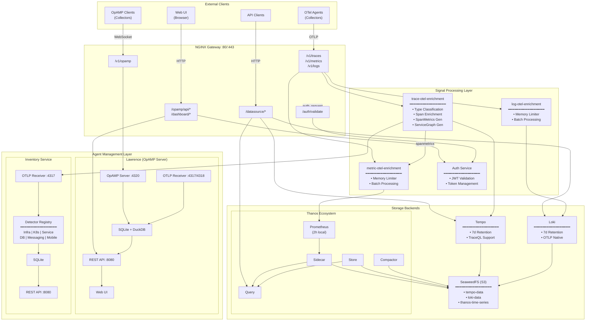
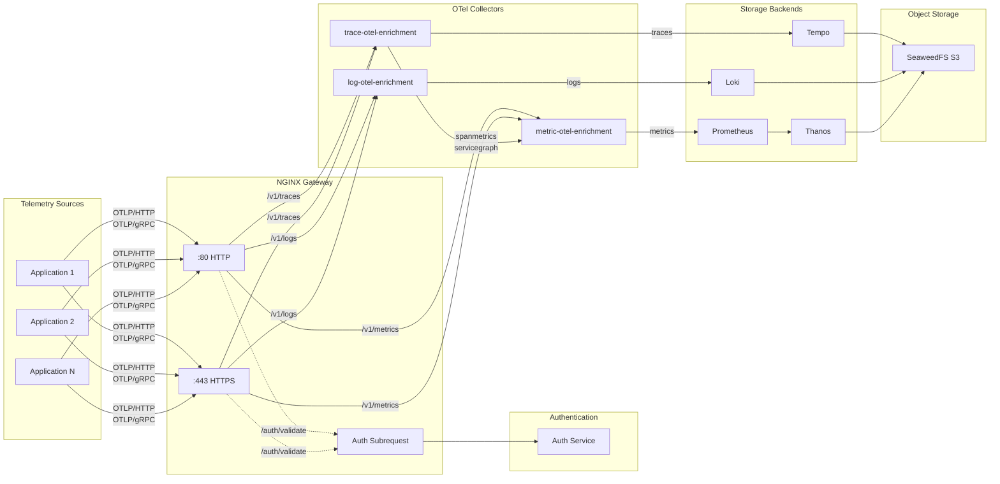
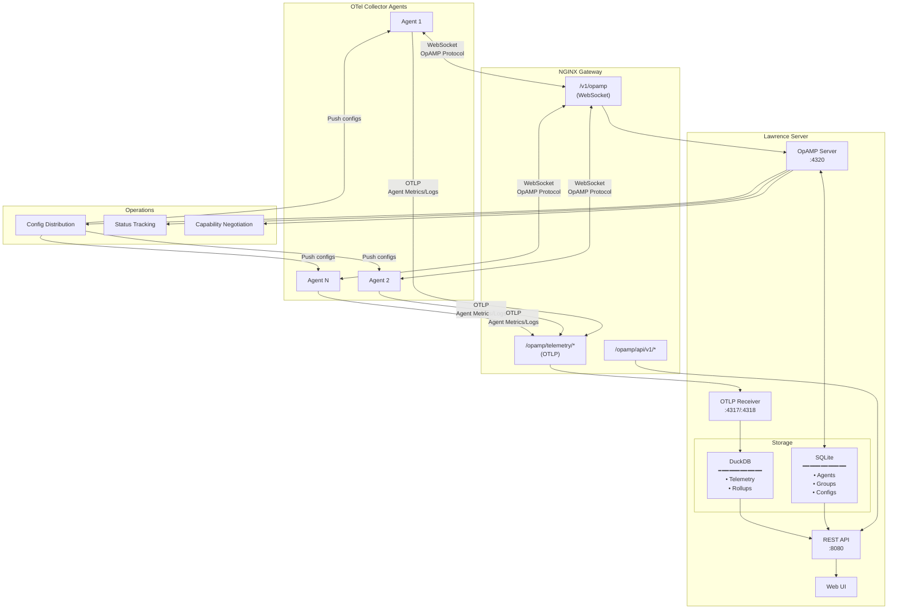
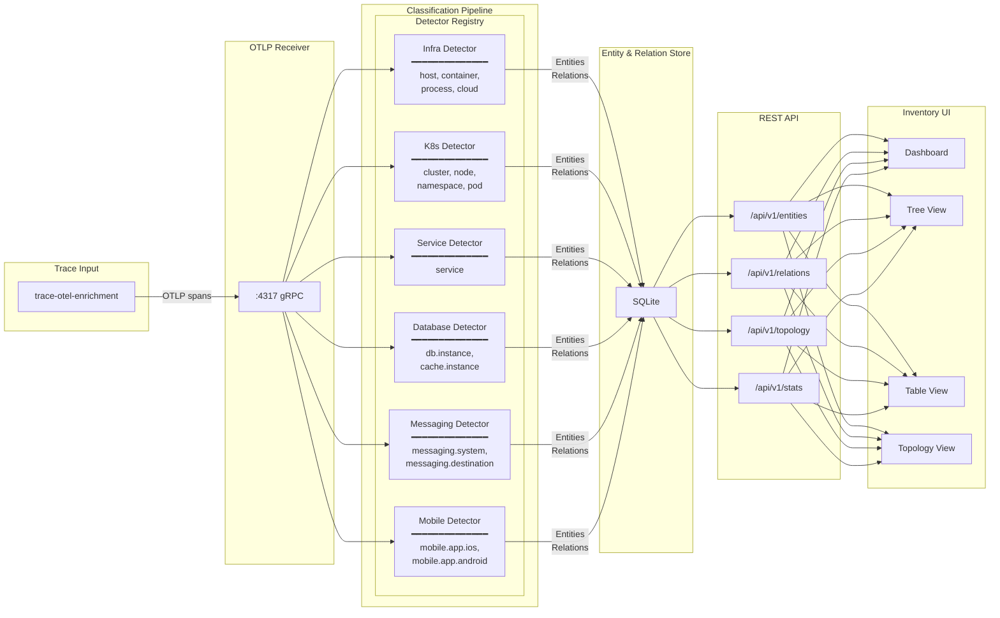
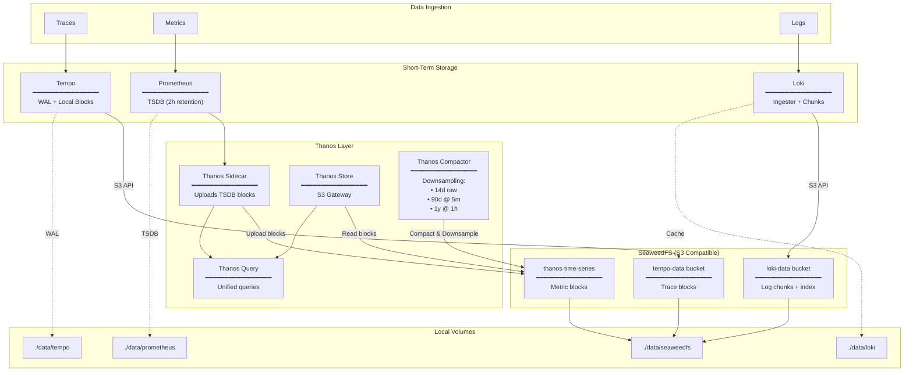
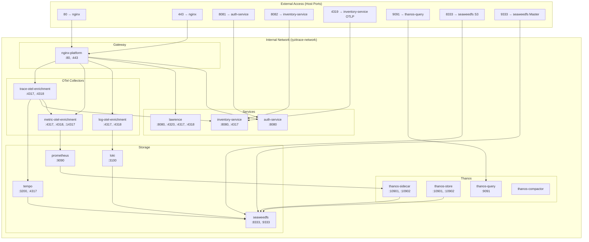
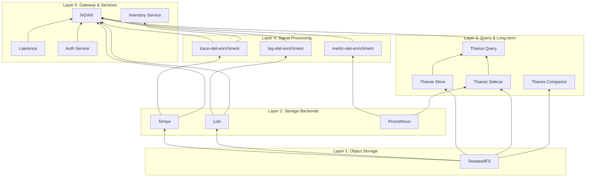

# Iyzitrace Observability Platform - Architecture

## Mermaid Diagrams

### High-Level Architecture



### Telemetry Ingestion Flow



### OpAMP Agent Management Flow



### Inventory Service - Entity Detection Flow



### Storage Architecture



### Network & Port Mapping



### Component Dependencies



---

## ASCII Architecture Diagrams

### High-Level Architecture Diagram

```
                                    ┌─────────────────────────────────────────────────────────────────────────────────┐
                                    │                              EXTERNAL CLIENTS                                    │
                                    │   ┌──────────────┐  ┌──────────────┐  ┌──────────────┐  ┌──────────────┐       │
                                    │   │ OTel Agents  │  │   Web UI     │  │  API Clients │  │OpAMP Clients │       │
                                    │   │ (Collectors) │  │  (Browser)   │  │              │  │ (Collectors) │       │
                                    │   └──────┬───────┘  └──────┬───────┘  └──────┬───────┘  └──────┬───────┘       │
                                    └──────────┼─────────────────┼─────────────────┼─────────────────┼───────────────┘
                                               │                 │                 │                 │
                                               │ OTLP            │ HTTP            │ HTTP            │ WebSocket
                                               │ (4317/4318)     │                 │                 │ (OpAMP)
                                               ▼                 ▼                 ▼                 ▼
┌──────────────────────────────────────────────────────────────────────────────────────────────────────────────────────────┐
│                                           NGINX GATEWAY (Port 80/443)                                                     │
│  ┌─────────────────────────────────────────────────────────────────────────────────────────────────────────────────────┐ │
│  │                                              ROUTING LAYER                                                           │ │
│  │  ┌───────────────┐  ┌───────────────┐  ┌───────────────┐  ┌───────────────┐  ┌───────────────┐  ┌───────────────┐  │ │
│  │  │  /v1/traces   │  │  /v1/metrics  │  │   /v1/logs    │  │  /v1/opamp    │  │  /opamp/api/  │  │  /dashboard/  │  │ │
│  │  └───────┬───────┘  └───────┬───────┘  └───────┬───────┘  └───────┬───────┘  └───────┬───────┘  └───────┬───────┘  │ │
│  │          │                  │                  │                  │                  │                  │          │ │
│  │  ┌───────────────┐  ┌───────────────┐  ┌───────────────┐                                                           │ │
│  │  │/datasource/   │  │/datasource/   │  │/datasource/   │    Auth Request (/auth/validate) ─────────────────────┐   │ │
│  │  │   traces/     │  │   metrics/    │  │    logs/      │                                                       │   │ │
│  │  └───────┬───────┘  └───────┬───────┘  └───────┬───────┘                                                       │   │ │
│  └──────────┼──────────────────┼──────────────────┼──────────────────────────────────────────────────────────────┼───┘ │
│             │                  │                  │                                                               │     │
│             │     API Key Auth                    │                                                               ▼     │
└─────────────┼──────────────────┼──────────────────┼─────────────────────────────────────────────────────────────────────┘
              │                  │                  │                  │                  │                  │
              ▼                  ▼                  ▼                  ▼                  ▼                  ▼
┌─────────────────────────────────────────────────────────────────────────────────────────────────────────────────────────┐
│                                        SIGNAL PROCESSING LAYER                                                          │
│                                                                                                                          │
│  ┌──────────────────────────┐  ┌──────────────────────────┐  ┌──────────────────────────┐  ┌───────────────────────────┐│
│  │  trace-otel-enrichment   │  │  metric-otel-enrichment  │  │   log-otel-enrichment    │  │      AUTH SERVICE         ││
│  │  ═══════════════════════ │  │  ════════════════════════│  │  ═══════════════════════ │  │  ═════════════════════    ││
│  │  • OTLP Receiver         │  │  • OTLP Receiver         │  │  • OTLP Receiver         │  │  • JWT Validation         ││
│  │  • Type Classification   │  │  • Memory Limiter        │  │  • Memory Limiter        │  │  • JWT Validation             ││
│  │  • Span Enrichment       │  │  • Batch Processing      │  │  • Batch Processing      │  │  • Token Management           ││
│  │  • Span Metrics Gen      │  │                          │  │                          │  │  • UI Dashboard               ││
│  │  • Service Graph Gen     │  │                          │  │                          │  │                               ││
│  └────────┬──────┬──────────┘  └────────────┬─────────────┘  └─────────────┬────────────┘  └───────────────────────────┘│
│           │      │                          │                              │                                             │
│           │      │  ┌───────────────────────┘                              │                                             │
│           │      │  │                                                      │                                             │
│           │      │  │   ┌──────────────────────────────────────────────────┼─────────────────────────────────────────┐  │
│           │      │  │   │                                                  │                                         │  │
│           ▼      │  │   ▼                                                  ▼                                         │  │
│  ┌────────────┐  │  │  ┌────────────────────────────┐             ┌─────────────────────┐                            │  │
│  │ Inventory  │  │  │  │       PROMETHEUS           │             │        LOKI         │                            │  │
│  │  Service   │  │  │  │  ═════════════════════════ │             │  ═══════════════════│                            │  │
│  │ ══════════ │  │  │  │  • 2h Local Retention      │             │  • 7d Retention     │                            │  │
│  │ • Semrev   │  │  │  │  • OTLP Receiver Enabled   │             │  • S3 via SeaweedFS │                            │  │
│  │ • Entity   │  │  │  │  • Recording Rules         │             │  • OTLP Native      │                            │  │
│  │   Detection│  │  │  │  • Exemplar Storage        │             │  • Stream Limits    │                            │  │
│  │ • Topology │  │  │  └─────────────┬──────────────┘             └──────────┬──────────┘                            │  │
│  │ • API      │  │  │                │                                       │                                       │  │
│  └────────────┘  │  │                │                                       │                                       │  │
│                  │  │                ▼                                       │                                       │  │
│                  │  │   ┌─────────────────────────────────────────┐          │                                       │  │
│                  │  │   │         THANOS ECOSYSTEM                │          │                                       │  │
│                  │  │   │  ═══════════════════════════════════════│          │                                       │  │
│                  │  │   │  ┌───────────────┐  ┌───────────────┐   │          │                                       │  │
│                  │  │   │  │Thanos Sidecar │  │ Thanos Store  │   │          │                                       │  │
│                  │  │   │  │ (Uploads      │  │ (S3 Gateway)  │   │          │                                       │  │
│                  │  │   │  │  TSDB blocks) │  │               │   │          │                                       │  │
│                  │  │   │  └───────┬───────┘  └───────┬───────┘   │          │                                       │  │
│                  │  │   │          │                  │           │          │                                       │  │
│                  │  │   │          ▼                  ▼           │          │                                       │  │
│                  │  │   │  ┌─────────────────────────────────┐   │          │                                       │  │
│                  │  │   │  │        Thanos Query             │   │          │                                       │  │
│                  │  │   │  │   (Unified Metric Queries)      │   │          │                                       │  │
│                  │  │   │  └─────────────────────────────────┘   │          │                                       │  │
│                  │  │   │  ┌─────────────────────────────────┐   │          │                                       │  │
│                  │  │   │  │      Thanos Compactor           │   │          │                                       │  │
│                  │  │   │  │  (Downsampling & Retention)     │   │          │                                       │  │
│                  │  │   │  │  • 14d raw, 90d 5m, 1y 1h       │   │          │                                       │  │
│                  │  │   │  └─────────────────────────────────┘   │          │                                       │  │
│                  │  │   └─────────────────────────────────────────┘          │                                       │  │
│                  │  │                                                        │                                       │  │
│                  ▼  ▼                                                        ▼                                       │  │
│           ┌──────────────────────┐                              ┌───────────────────────┐                            │  │
│           │        TEMPO         │                              │      SeaweedFS        │◄─────────────────────────────┘  │
│           │  ════════════════════│                              │   (S3 Compatible)     │                               │
│           │  • Distributed       │                              │  ═════════════════════│                               │
│           │    Tracing           │─────────────────────────────►│  • tempo-data bucket  │                               │
│           │  • 7d Retention      │                              │  • loki-data bucket   │                               │
│           │  • S3 via SeaweedFS  │                              │  • thanos-time-series │                               │
│           │  • TraceQL Support   │                              │    bucket             │                               │
│           └──────────────────────┘                              └───────────────────────┘                               │
│                                                                                                                          │
└──────────────────────────────────────────────────────────────────────────────────────────────────────────────────────────┘

┌──────────────────────────────────────────────────────────────────────────────────────────────────────────────────────────┐
│                                          AGENT MANAGEMENT LAYER                                                          │
│                                                                                                                          │
│  ┌───────────────────────────────────────────────────────────────────────────────────────────────────────────────────┐  │
│  │                                           LAWRENCE (OpAMP Server)                                                  │  │
│  │  ═════════════════════════════════════════════════════════════════════════════════════════════════════════════════│  │
│  │                                                                                                                    │  │
│  │  ┌─────────────────────┐  ┌─────────────────────┐  ┌─────────────────────┐  ┌─────────────────────────────────┐   │  │
│  │  │    OpAMP Server     │  │    OTLP Receiver    │  │      REST API       │  │          Web UI                 │   │  │
│  │  │    (Port 4320)      │  │   (4317/4318)       │  │     (Port 8080)     │  │     (Embedded React)            │   │  │
│  │  │  ─────────────────  │  │  ─────────────────  │  │  ─────────────────  │  │  ─────────────────────────────  │   │  │
│  │  │  • WebSocket conn   │  │  • Agent telemetry  │  │  • Agent CRUD       │  │  • Agent dashboard              │   │  │
│  │  │  • Config push      │  │  • Internal metrics │  │  • Group management │  │  • Config editor                │   │  │
│  │  │  • Status tracking  │  │  • Store in DuckDB  │  │  • Telemetry query  │  │  • Topology view                │   │  │
│  │  │  • Capabilities     │  │                     │  │  • Lawrence QL      │  │  • Health monitoring            │   │  │
│  │  └─────────────────────┘  └─────────────────────┘  └─────────────────────┘  └─────────────────────────────────┘   │  │
│  │                                                                                                                    │  │
│  │  Storage:  SQLite (agents, groups, configs)  +  DuckDB (telemetry, rollups)                                       │  │
│  └───────────────────────────────────────────────────────────────────────────────────────────────────────────────────┘  │
│                                                                                                                          │
│  ┌───────────────────────────────────────────────────────────────────────────────────────────────────────────────────┐  │
│  │                                    INVENTORY SERVICE (Semantic Reverse Classification)                             │  │
│  │  ═════════════════════════════════════════════════════════════════════════════════════════════════════════════════│  │
│  │                                                                                                                    │  │
│  │  ┌─────────────────────┐  ┌─────────────────────────────────────────────────────────────┐  ┌────────────────────┐ │  │
│  │  │   OTLP Receiver     │  │                    Detector Registry                        │  │     REST API       │ │  │
│  │  │   (Port 4317)       │──►  ┌──────┐ ┌──────┐ ┌────────┐ ┌──────┐ ┌─────────┐ ┌──────┐│──►   (Port 8080)     │ │  │
│  │  │  ─────────────────  │  │  │Infra │ │ K8s  │ │Service │ │  DB  │ │Messaging│ │Mobile││  │  ────────────────  │ │  │
│  │  │  • Traces from      │  │  └──────┘ └──────┘ └────────┘ └──────┘ └─────────┘ └──────┘│  │  • /api/v1/entities│ │  │
│  │  │    trace-otel       │  └─────────────────────────────────────────────────────────────┘  │  • /api/v1/relations│ │  │
│  │  │  • Entity detection │                              │                                    │  • /api/v1/topology│ │  │
│  │  └─────────────────────┘                              ▼                                    └────────────────────┘ │  │
│  │                                              ┌────────────────┐                                                    │  │
│  │                                              │ SQLite Storage │                                                    │  │
│  │                                              │ (Entities,     │                                                    │  │
│  │                                              │  Relations)    │                                                    │  │
│  │                                              └────────────────┘                                                    │  │
│  └───────────────────────────────────────────────────────────────────────────────────────────────────────────────────┘  │
│                                                                                                                          │
│  ┌───────────────────────────────────────────────────────────────────────────────────────────────────────────────────┐  │
│  │                                              INVENTORY UI                                                          │  │
│  │  ═════════════════════════════════════════════════════════════════════════════════════════════════════════════════│  │
│  │  • React + TypeScript + Vite                                                                                      │  │
│  │  • Dashboard, Tree View, Table View, Topology View                                                                │  │
│  │  • Proxies API calls to inventory-service via embedded Nginx                                                      │  │
│  └───────────────────────────────────────────────────────────────────────────────────────────────────────────────────┘  │
│                                                                                                                          │
└──────────────────────────────────────────────────────────────────────────────────────────────────────────────────────────┘
```

---

## Component Breakdown

### 1. NGINX Gateway (Entry Point)

The NGINX gateway serves as the unified entry point for all traffic, handling:

| Route | Destination | Purpose |
|-------|-------------|---------|
| `/v1/traces` | trace-otel-enrichment:4318 | OTLP trace ingestion |
| `/v1/metrics` | metric-otel-enrichment:4318 | OTLP metric ingestion |
| `/v1/logs` | log-otel-enrichment:4318 | OTLP log ingestion |
| `/v1/opamp` | lawrence:4320 | OpAMP WebSocket connections |
| `/opamp/api/v1/*` | lawrence:8080 | Lawrence REST API |
| `/opamp/telemetry/*` | lawrence:4318 | Agent-specific telemetry |
| `/dashboard/*` | auth-service:8080 | Auth dashboard UI |
| `/datasource/metrics/` | thanos-query:9091 | Prometheus/Thanos queries |
| `/datasource/traces/` | tempo:3200 | Tempo trace queries |
| `/datasource/logs/` | loki:3100 | Loki log queries |

**Security Features:**
- HTTP (port 80) and HTTPS (port 443)
- Auth subrequests to `/auth/validate` for protected endpoints
- Keepalive connections (64 per upstream)

---

### 2. Signal Processing Layer (OTel Collectors)

Three dedicated OpenTelemetry Collector instances handle signal-specific enrichment:

#### trace-otel-enrichment
```yaml
Pipeline: OTLP → Processors → [Tempo, Inventory, SpanMetrics, ServiceGraph]
```
- **Type Classification**: Categorizes spans (http, database, messaging, cache, rpc)
- **Span Enrichment**: Adds `operation.name`, `host.name` attributes
- **Span Metrics Generation**: Creates RED metrics from traces (via spanmetrics connector)
- **Service Graph Generation**: Builds service dependency topology

#### metric-otel-enrichment
```yaml
Pipeline: OTLP → Processors → Prometheus (via OTLP write)
```
- Receives span-derived metrics from trace-otel-enrichment
- Processes and forwards to Prometheus OTLP endpoint

#### log-otel-enrichment
```yaml
Pipeline: OTLP → Processors → Loki
```
- Processes logs with batch and memory limiting
- Exports to Loki via OTLP/HTTP

---

### 3. Storage Backends

#### Tempo (Distributed Tracing)
- **Retention**: 7 days
- **Storage**: SeaweedFS S3 (`tempo-data` bucket)
- **Features**: TraceQL support, exemplar links

#### Loki (Log Aggregation)
- **Retention**: 7 days (168h)
- **Storage**: SeaweedFS S3 (`loki-data` bucket)
- **Index Labels**: level, service_name, service_namespace, agent.id, agent.name, agent.group_id
- **Limits**: 5000 max global streams, 10MB/s ingestion rate

#### Prometheus + Thanos (Metrics)
- **Prometheus Local Retention**: 2 hours (ephemeral)
- **Thanos Long-term**: S3 via SeaweedFS (`thanos-time-series` bucket)
- **Downsampling**:
  - Raw: 14 days
  - 5-minute resolution: 90 days
  - 1-hour resolution: 1 year

**Thanos Components:**
| Component | Role |
|-----------|------|
| Sidecar | Uploads TSDB blocks from Prometheus to S3 |
| Store | Gateway for querying historical data from S3 |
| Query | Unified query layer across sidecar + store |
| Compactor | Downsamples and applies retention policies |

#### SeaweedFS (Object Storage)
- S3-compatible storage for all backends
- **Buckets**: `tempo-data`, `loki-data`, `thanos-time-series`
- Single-node deployment (development mode)

---

### 4. Agent Management (Lawrence)

Lawrence is the OpAMP-based agent management server:

| Port | Protocol | Purpose |
|------|----------|---------|
| 8080 | HTTP | REST API + Web UI |
| 4320 | WebSocket | OpAMP agent connections |
| 4317 | gRPC | OTLP (agent telemetry) |
| 4318 | HTTP | OTLP (agent telemetry) |

**Capabilities:**
- Remote configuration management for OTel collectors
- Agent grouping and bulk operations
- Agent telemetry ingestion and storage
- Lawrence QL query language
- Topology visualization

**Storage:**
- SQLite: Agent metadata, groups, configurations
- DuckDB: Raw telemetry and aggregated rollups

---

### 5. Inventory Service (Semantic Reverse Classification)

Analyzes incoming telemetry to automatically detect and classify entities:

**Entity Types Detected:**
- **Infrastructure**: cloud.region, host, container, process
- **Kubernetes**: cluster, node, namespace, pod
- **Services**: service
- **Databases**: db.instance, db.database, cache.instance
- **Messaging**: messaging.system, messaging.destination
- **Mobile**: mobile.app, mobile.app.ios, mobile.app.android

**Relationship Types:**
- `runs_on`, `runs_in`, `located_in`, `uses`
- `publishes_to`, `consumes_from`, `belongs_to`, `part_of`

**Data Flow:**
```
trace-otel-enrichment → (OTLP) → Inventory Service → SQLite → REST API → Inventory UI
```

---

### 6. Authentication Service

Handles authentication and authorization:

- **JWT Token Validation**: API key authentication
- **Dashboard UI**: Token management interface

---

## Data Flow Diagrams

### Telemetry Ingestion Flow

```
┌─────────────┐    OTLP/HTTP     ┌───────────┐    Routes    ┌────────────────────────┐
│ Application │───────────────►  │   NGINX   │ ───────────► │  OTel Enrichment       │
│  (w/ OTel)  │    :80/:443     │  Gateway  │              │  Collectors            │
└─────────────┘                  └───────────┘              └───────────┬────────────┘
                                       │                               │
                                       │ /auth/validate                │
                                       ▼                               │
                                 ┌───────────┐                         │
                                 │   Auth    │                         │
                                 │  Service  │                         │
                                 └───────────┘                         │
                                                                       │
                    ┌──────────────────────────────────────────────────┤
                    │                      │                           │
                    ▼                      ▼                           ▼
             ┌──────────┐           ┌──────────┐               ┌──────────────┐
             │  Tempo   │           │   Loki   │               │ Prometheus   │
             │ (Traces) │           │  (Logs)  │               │  (Metrics)   │
             └────┬─────┘           └────┬─────┘               └──────┬───────┘
                  │                      │                            │
                  │                      │                            ▼
                  │                      │                     ┌──────────────┐
                  │                      │                     │   Thanos     │
                  │                      │                     │  (Long-term) │
                  │                      │                     └──────┬───────┘
                  │                      │                            │
                  └──────────────────────┴────────────────────────────┘
                                         │
                                         ▼
                                  ┌──────────────┐
                                  │  SeaweedFS   │
                                  │ (S3 Storage) │
                                  └──────────────┘
```

### OpAMP Agent Management Flow

```
┌─────────────────┐     WebSocket      ┌───────────┐                ┌───────────────┐
│  OTel Collector │────────────────►   │   NGINX   │ ─────────────► │   Lawrence    │
│  (with OpAMP)   │   /v1/opamp        │  Gateway  │   :4320        │  OpAMP Server │
└────────┬────────┘                    └───────────┘                └───────┬───────┘
         │                                                                  │
         │                                                                  │
         │  Agent Telemetry                                                 │
         │  (OTLP)                                                          │
         │                                                          ┌───────┴───────┐
         │                                                          │               │
         ▼                                                          ▼               ▼
┌─────────────────┐                                          ┌──────────┐   ┌──────────┐
│     NGINX       │                                          │  SQLite  │   │  DuckDB  │
│ /opamp/telemetry│──────────────► Lawrence:4318 ──────────► │ (Config) │   │(Telemetry)│
└─────────────────┘                                          └──────────┘   └──────────┘
```

---

## Network Topology

```
┌─────────────────────────────────────────────────────────────────────────────┐
│                          iyzitrace-network (bridge)                          │
│                                                                              │
│  External Ports:                                                             │
│  ───────────────                                                             │
│  80, 443    → nginx-platform                                                 │
│  8081       → auth-service                                                   │
│  8082       → inventory-service (HTTP API)                                   │
│  4319       → inventory-service (OTLP gRPC)                                  │
│  9091       → thanos-query                                                   │
│  8333, 9333 → seaweedfs (S3 + Master)                                        │
│                                                                              │
│  Internal Services (no external port exposure):                              │
│  ──────────────────────────────────────────────                              │
│  tempo:3200, tempo:4317                                                      │
│  loki:3100                                                                   │
│  prometheus:9090                                                             │
│  lawrence:8080, lawrence:4320, lawrence:4317, lawrence:4318                  │
│  trace-otel-enrichment:4317, :4318                                           │
│  metric-otel-enrichment:4317, :4318, :14317                                  │
│  log-otel-enrichment:4317, :4318                                             │
│  thanos-sidecar:10901, :10902                                                │
│  thanos-store:10901, :10902                                                  │
│                                                                              │
└─────────────────────────────────────────────────────────────────────────────┘
```

---

## Persistent Volumes

| Volume | Path | Service | Purpose |
|--------|------|---------|---------|
| `tempo-data` | `./data/tempo` | Tempo | Trace blocks (WAL) |
| `loki-data` | `./data/loki` | Loki | Log chunks |
| `prometheus-data` | `./data/prometheus` | Prometheus + Sidecar | TSDB blocks |
| `seaweedfs-data` | `./data/seaweedfs` | SeaweedFS | Object storage |
| `thanos-store-data` | `./data/thanos-store` | Thanos Store | Cache |
| `thanos-compactor-data` | `./data/thanos-compactor` | Thanos Compactor | Work directory |
| `auth-data` | `./data/auth` | Auth Service | SQLite DB |
| `lawrence-data` | `./data/lawrence` | Lawrence | SQLite + DuckDB |
| `inventory-data` | `./data/inventory` | Inventory Service | SQLite DB |

---

## Technology Stack Summary

| Layer | Technology | Purpose |
|-------|------------|---------|
| Gateway | NGINX 1.27 | Routing, TLS, auth subrequests |
| Collectors | OTel Collector Contrib | Signal processing & enrichment |
| Traces | Grafana Tempo | Distributed tracing storage |
| Logs | Grafana Loki | Log aggregation |
| Metrics | Prometheus + Thanos | Short + long-term metrics |
| Object Storage | SeaweedFS | S3-compatible storage |
| Agent Mgmt | Lawrence (Go) | OpAMP server |
| Inventory | Inventory Service (Go) | Entity classification |
| Auth | Auth Service (Node.js) | Authentication |
| UIs | React + TypeScript | Dashboard interfaces |

---

## Key Architectural Decisions

1. **Unified Ingestion Point**: All telemetry flows through NGINX, enabling centralized auth and routing
2. **Signal Separation**: Dedicated OTel collectors per signal type for independent scaling
3. **Span-to-Metrics**: Automatic RED metrics generation from traces via spanmetrics connector
4. **Long-term Metrics**: Thanos provides unlimited retention with downsampling
5. **S3 Backend**: SeaweedFS provides local S3-compatible storage for all backends
6. **OpAMP for Agent Management**: Lawrence enables remote configuration of collectors
7. **Semantic Classification**: Inventory service auto-discovers infrastructure topology from telemetry
